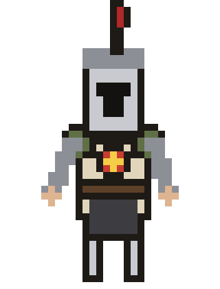

<table align="center" width="100%">
<tr>
<td width="100%">

> *"If only I could be so grossly incandescent."*

- 🕯️ Currently escaping the shackles of proprietary tools, one open-source repo at a time
- ⚔️ Seeking fellow sunlight warriors to co-op on **AI**, **ML**, **Data**, and **Full Stack** projects with real meaning
- 📜 Studying towards Microsoft certifications in **Data Science**
- 🗡️ Ask me about Souls games — I *will* talk your ear off about boss design

</td>
</tr>
</table>

 

 

 

 

 

 

<!--START_SECTION:waves-->

<!--END_SECTION:waves-->

  

